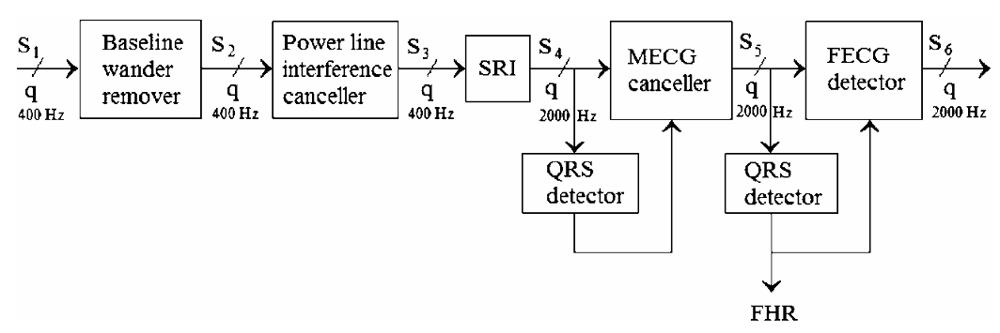

# Project Biomedical Signal Processing

Angelica Porcelli

### Fetal ECG Extraction — Sequential Method (Martens 2007)

This repository contains a full implementation of the sequential analysis method for non-invasive fetal ECG (FECG) extraction described in: Martens et al., A robust fetal ECG detection method for abdominal recordings, Physiological Measurement, 2007.

The pipeline reproduces all major processing blocks of the original paper, including signal preprocessing, maternal ECG cancellation, fetal QRS detection, and fetal ECG reconstruction.

## Repository 
**Pipeline Overview** 

The method processes multi-channel abdominal ECG through a sequence of well-defined stages: 

---

### Structure
- **`Angelica_Porcelli_F-ECG-Extraction.ipynb`**: Main Pipeline Execution Notebook. This is the primary file containing the entire sequence of steps for Fetal ECG ($\text{fECG}$) extraction. It serves as the executable demonstration of the Martens algorithm implementation.

--- 

- **`validation.ipynb`**: Dataset A Full Validation Report. A Jupyter Notebook dedicated to running the complete pipeline and calculating comprehensive metrics ($\text{F1}$, $\text{ACC}$, $\text{SE}$, $\text{PPV}$, $\text{SNR}$, $\text{SIR}$, $\text{Reliability}$) across all records in Dataset A.
- **`validation_ICA.ipynb`**: Dataset A Full Validation Report using also FastICA methods.

- **`pipeline_vs_ICA.ipynb`**: Test e comparison Pipeline that follow the Paper and FastICA algorithm on all dataset.
- **`metrics_on_dataset.ipynb`**: Comparison of the result of the metrics of the algorithm on the Dataset A.

---

In **modules:**
- **`cleaning.py`**: Pre-processing and Noise Reduction. This module contains all functions necessary to prepare the raw abdominal signal before component separation. (S1, S2, S3, S4)
- **`qrsdetection.py`**:  ECG Peak Detection and Signal Enhancement. This module implements the methods used to accurately locate both maternal and fetal $\text{QRS}$ complexes, and to enhance signal quality via channel selection. (M-QRS, F-QRS)
- **`mecgcanceller.py`**: Maternal ECG Removal. This module implements the core component separation technique used to model and subtract the dominant maternal interference. (S5)
- **`fecgextraction.py`**: Final Signal Validation and Reporting. This module typically handles the final steps of post-processing, validation, and summarizing the results after the $\text{fECG}$ signal has been isolated. (S6)
- **`fastICA.py`**: applies FastICA to abdominal ECG, detects fetal QRS on the independent components, selects the best fetal component, and compares its performance with ground truth.
- **`metrics.py`**: Performance Metrics and Evaluation. This module provides quantitative performance measures used to evaluate the extraction quality, including fetal heart rate detection reliability, signal-to-noise ratio (SNR), signal-to-interference ratio (SIR), and other global evaluation metrics.

- **`utils.py`** & **`function.py`**: Utility Functions for Visualization and Metrics. This module houses helper functions essential for data analysis and visual validation, separate from the core signal processing logic.

---
In **result:**

- **`A_RESULT.csv`**: This file contains the performance metrics computed for the model-based pipeline proposed in the paper. The reported metrics quantify fetal QRS detection $\text{SNR}$, $\text{SIR}$, $\text{Reliability}$, $\text{F1}$, $\text{ACC}$, $\text{SE}$, $\text{PPV}$ (created by validation.ipynb);
- **`comparison.csv`**: This file extends the analysis by including the same performance metrics computed for a FastICA-based approach, enabling a direct comparison with the proposed pipeline. In adding there are $\text{ica\_best\_comp}$, $\text{ica\_qrs}$, $\text{ica\_mean\_fhr}$, $\text{ica\_rel}$, $\text{ica\_mae}$, $\text{ica\_rmse}$, $\text{ica\_rel\_dist}$ (created by validation_ICA.ipynb).

---

### Reference & Dataset

Martens S.M.M., Rabotti C., Mischi M., Sluijter R.J. (2007).
A robust fetal ECG detection method for abdominal recordings.
Physiological Measurement, 28(4), 373–388.

The pipeline has been tested on the PhysioNet / CinC Challenge 2013 abdominal ECG dataset
(records a01–a25) (https://physionet.org/content/challenge-2013/1.0.0/).

---

**License:** [Creative Commons Attribution 4.0 International License (CC BY 4.0)](https://creativecommons.org/licenses/by/4.0/deed.en)
